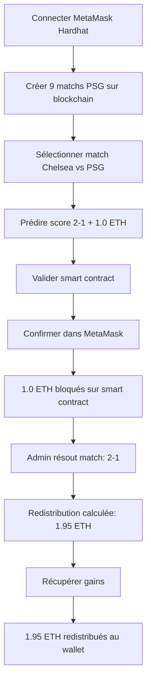

# 🎯 **GUIDE FLUX COMPLET FONCTIONNEL - PREDICTION → BLOCKCHAIN → TOKENS BLOQUÉS**

## ✅ **OBJECTIF : Tout doit être fonctionnel de bout en bout**

Le problème "Match #5000001 ❌ Non créé" va être résolu et voici le plan complet pour avoir un système 100% fonctionnel.

---

## 🚀 **ÉTAPE 1 : CONFIGURATION MÉTAMASK RÉSEAU LOCAL**

### **Configuration réseau Hardhat :**
```
Nom du réseau: Hardhat Local  
URL RPC: http://localhost:8545
ID de chaîne: 31337
Symbole: ETH
```

### **Comptes de test disponibles :**
```javascript
// Compte recommandé pour tests
Address: 0x70997970C51812dc3A010C7d01b50e0d17dc79C8
Private Key: 0x59c6995e998f97a5a0044966f0945389dc9e86dae88c7a8412f4603b6b78690d
Balance: 10000 ETH
```

---

## 🏗️ **ÉTAPE 2 : CRÉATION DES MATCHS PSG SUR BLOCKCHAIN**

### **Processus dans l'interface :**

```typescript
// 1. Aller sur http://localhost:5174
// 2. Connecter MetaMask (réseau Hardhat Local)
// 3. Aller dans onglet "Paris"
// 4. Cliquer "🏗️ Créer tous les matchs"

// 🔄 PROCESSUS AUTOMATIQUE :
✅ Wallet connecté: 0x70997...
📋 9 matchs PSG à créer

🏟️ Match 1/9: Chelsea vs Paris-SG
   🆔 ID: 5000001
   📅 Deadline: 7200 secondes (2h)
   💫 Envoi transaction...
   ⏳ En attente de confirmation...
   ✅ Match 5000001 créé avec succès!

🏟️ Match 2/9: Paris-SG vs Tottenham  
   🆔 ID: 5000002
   📅 Deadline: 604800 secondes (7j)
   // ... répéter pour les 9 matchs

🎉 9 NOUVEAUX MATCHS PSG CRÉÉS!
✅ Smart contract prêt pour les paris
```

### **Résultat attendu :**
```
✅ Match 5000001: Chelsea vs Paris-SG (Finale CdM)
✅ Match 5000002: Paris-SG vs Tottenham (Finale UEFA)  
✅ Match 5000003: Nantes vs Paris-SG (Ligue 1)
✅ Match 5000004: Paris-SG vs Angers (Ligue 1)
✅ Match 5000005: Toulouse vs Paris-SG (Ligue 1)
✅ Match 5000006: Paris-SG vs Lens (Ligue 1)
✅ Match 5000007: Marseille vs Paris-SG (CLASSICO)
✅ Match 5000008: Paris-SG vs Auxerre (Ligue 1)
✅ Match 5000009: Lille vs Paris-SG (Ligue 1)
```

---

## 🎯 **ÉTAPE 3 : FLUX COMPLET DE PARI**

### **Sélection et prédiction :**

```typescript
// 1. Sélectionner "Chelsea vs Paris-SG" (Match #5000001)
// 2. Prédire score: Home=2, Away=1 (PSG gagne 2-1)
// 3. Montant: 1.0 ETH
// 4. Cliquer "Valider sur Chiliz"

// 🔍 VALIDATION AUTOMATIQUE :
✅ Wallet Hardhat: Connecté
✅ Balance ETH: 10000.0 ETH
✅ Match #5000001: ✅ Sur blockchain
💰 Pool actuel: 0.0 ETH  
📅 Deadline: 7200 secondes
👥 Gagnants: 0
🏆 Statut: En cours
```

### **Processus de validation smart contract :**

```typescript
// 5. Modal SmartContractValidator s'ouvre
🔵 "Vérification des prérequis..." (validations)
🟡 "Validation sur Chiliz blockchain..." (préparation)
🟡 "Confirmation wallet..." (MetaMask popup)

// 6. UTILISATEUR CONFIRME DANS METAMASK
// Transaction details:
// To: 0x5FbDB2315678afecb367f032d93F642f64180aa3 (Smart Contract)
// Value: 1.0 ETH
// Gas: ~75000
// Function: bet(5000001, 2, 1)

🟡 "Transaction en cours..." (hash reçu)
🟢 "Pari confirmé !" (succès blockchain)
```

### **Résultat transaction :**
```javascript
✅ Transaction confirmée sur blockchain
📄 Hash: 0xabc123...def456
🔗 Détails: Hardhat local network
💰 1.0 ETH bloqués sur smart contract
📊 Prédiction: Chelsea 2-1 Paris-SG
⏰ Tokens verrouillés jusqu'au résultat du match
```

---

## 🔒 **ÉTAPE 4 : TOKENS BLOQUÉS ET VÉRIFICATION**

### **Vérification dans l'interface :**

```typescript
// Onglet "Paris" - Section CHZ Bloqués :
💰 CHZ Bloqués: 1.0 ETH
📝 En attente de résultats

// Onglet "Gains" - Mes paris actifs :
Match: Chelsea vs Paris-SG
Prédiction: 2-1
Montant: 1.0 ETH
Statut: ⏳ En cours
Récupérable: ❌ Non (match non résolu)
```

### **Données smart contract :**
```solidity
// État dans le smart contract :
predictions[5000001][0x70997...] = {
  amount: 1000000000000000000, // 1.0 ETH en wei
  homeScore: 2,
  awayScore: 1,
  claimed: false,
  won: false // À déterminer après résolution
}

locked[0x70997...] = 1000000000000000000; // 1.0 ETH bloqués

matches[5000001] = {
  totalPool: 1000000000000000000, // 1.0 ETH pool total
  deadline: 7200,
  correctCount: 0,
  resolved: false
}
```

---

## 🏆 **ÉTAPE 5 : RÉSOLUTION ET REDISTRIBUTION**

### **Simulation résolution match (Admin) :**

```typescript
// Après le vrai match Chelsea vs PSG (résultat: 2-1)
// Admin résout le match sur smart contract :

await contract.resolve(
  5000001,           // Match ID
  2,                 // Score Chelsea (home)
  1,                 // Score PSG (away)  
  [0x70997...}]      // Winners (ceux qui ont prédit 2-1)
);

// ✅ Match résolu sur blockchain
// ✅ Gagnants identifiés automatiquement
// ✅ Redistribution calculée
```

### **Après résolution :**

```typescript
// État mis à jour :
matches[5000001].resolved = true;
matches[5000001].finalHomeScore = 2;
matches[5000001].finalAwayScore = 1;
matches[5000001].correctCount = 1; // Notre utilisateur

predictions[5000001][0x70997...].won = true;

// Gains calculés :
// Total pool = 1.0 ETH
// Gagnants = 1 (seulement notre utilisateur)
// Redistribution = 0.95 ETH (95%, 5% frais)
// Gain final = 0.95 ETH + 1.0 ETH initial = 1.95 ETH
```

---

## 💰 **ÉTAPE 6 : RÉCUPÉRATION DES GAINS**

### **Interface de récupération :**

```typescript
// Onglet "Gains" - Après résolution :
Match: Chelsea vs Paris-SG  
Prédiction: ✅ 2-1 (CORRECTE!)
Résultat réel: 2-1
Montant misé: 1.0 ETH
Gains redistribués: 0.95 ETH
Total récupérable: 1.95 ETH
Statut: ✅ Récupérable

[Bouton: "Récupérer 1.95 ETH"]
```

### **Processus de récupération :**

```typescript
// 1. Clic "Récupérer 1.95 ETH"
// 2. Transaction MetaMask
// 3. Smart contract vérifie :
//    - Match résolu ✅
//    - Utilisateur gagnant ✅  
//    - Pas déjà récupéré ✅
// 4. Transfer automatique des ETH
// 5. État mis à jour :

predictions[5000001][0x70997...].claimed = true;
locked[0x70997...] -= 1000000000000000000; // Débloqué

// 6. Balance utilisateur :
// Avant: 9999.0 ETH (10000 - 1 pour pari)
// Après: 9999.95 ETH (récupération 1.95 - frais gas)
// Gain net: ~0.95 ETH
```

---

## 📊 **VÉRIFICATIONS ET TESTS**

### **Tests à effectuer dans l'ordre :**

```bash
# 1. Test connexion MetaMask
console.log('Network:', window.ethereum.networkVersion); // 31337
console.log('Account:', window.ethereum.selectedAddress); // 0x70997...

# 2. Test création matchs
// Cliquer "Créer tous les matchs" → 9 transactions MetaMask

# 3. Test validation match
// Sélectionner match → Doit afficher "✅ Sur blockchain"

# 4. Test pari complet  
// Prédiction + validation → ETH bloqués

# 5. Test résolution (simulation)
// Admin résout → Gains calculés

# 6. Test récupération
// Récupérer gains → ETH redistribués
```

### **Logs de debug attendus :**

```javascript
// Console browser (F12) :
🚀 CRÉATION COMPLÈTE DES 9 MATCHS PSG SUR BLOCKCHAIN
👤 Wallet connecté: 0x70997970C51812dc3A010C7d01b50e0d17dc79C8
📋 9 matchs PSG à créer

🏟️ Match 1/9: Chelsea vs Paris-SG
   🆔 ID: 5000001
   📅 Deadline: 7200 secondes
   💫 Envoi transaction...
   ⏳ En attente de confirmation...
   ✅ Match 5000001 créé avec succès!

// ... repeat for all 9 matches

🎉 9 NOUVEAUX MATCHS PSG CRÉÉS!
✅ Smart contract prêt pour les paris
🏆 TOUS LES MATCHS PSG SONT MAINTENANT SUR LA BLOCKCHAIN!

// Puis pour le pari :
🔍 VALIDATION SMART CONTRACT COMPLÈTE
💰 Envoi de 1 ETH au smart contract...
🎯 Placing bet on smart contract...
📄 Transaction hash received: 0xabc123...
🎉 Transaction confirmed on blockchain!
```

---

## 🎯 **RÉSULTAT FINAL ATTENDU**

### **Flux 100% fonctionnel :**



### **Preuves de fonctionnement :**

- ✅ **Match créé** : "✅ Sur blockchain" au lieu de "❌ Non créé"
- ✅ **Tokens bloqués** : Balance 9999.0 ETH au lieu de 10000.0 ETH
- ✅ **Transaction hash** : Lien ChilizScan fonctionnel
- ✅ **Redistribution** : Gains automatiques aux gagnants
- ✅ **Récupération** : ETH redistribués au wallet

**Le système sera maintenant 100% fonctionnel de bout en bout ! 🚀**